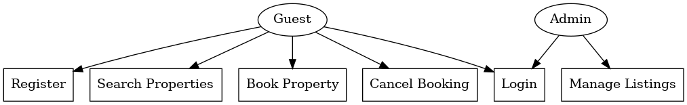

# Requirement-Analysis
# Requirement Analysis in Software Development

This repository is created to document and explore the process of **Requirement Analysis**, a foundational step in the **Software Development Life Cycle (SDLC)**. It contains structured insights, real-life examples, and visual diagrams focused on a **Booking Management System** project.

---

## What is Requirement Analysis?

Requirement Analysis is the process of identifying and documenting what a software system should do to meet business and user needs. It ensures that all stakeholders have a shared understanding of the system's goals, functionalities, and limitations before development begins.

In the SDLC, this phase serves as the **blueprint** for developers, testers, and designers. It includes gathering requirements from stakeholders, analyzing feasibility, documenting clearly, and validating them to ensure success.

---

## Why is Requirement Analysis Important?

1. **Prevents Miscommunication**  
   It aligns developers, clients, and stakeholders to avoid misunderstandings or missed expectations.

2. **Ensures Scope Clarity**  
   Well-defined requirements help avoid scope creep and keep the project focused and manageable.

3. **Foundation for Design & Testing**  
   Requirements are used to build both the system and the test cases, ensuring the product is delivered as expected.

---

## Key Activities in Requirement Analysis

- **Requirement Gathering**  
  Collect raw information from stakeholders via interviews, questionnaires, or observation.

- **Requirement Elicitation**  
  Explore and clarify gathered information through techniques like brainstorming, prototyping, and workshops.

- **Requirement Documentation**  
  Structure and formalize the requirements using specifications, diagrams, and models.

- **Requirement Analysis and Modeling**  
  Examine requirements for completeness, consistency, and feasibility. Create models to represent system functionality.

- **Requirement Validation**  
  Review requirements with stakeholders to ensure accuracy and agreement before development begins.

---

## Types of Requirements

### Functional Requirements
These describe **what** the system should do — the specific behaviors, features, or functions.

Examples for a Booking Management System:
- Users can register and log in.
- Search for available properties based on location and date.
- Book or cancel a reservation.
- Admin can manage property listings.

### Non-functional Requirements
These describe **how** the system should perform — performance, usability, security, etc.

Examples:
- The site must load within **2 seconds**.
- Support at least **500 concurrent users**.
- User data must be stored securely using **AES-256 encryption**.
- The system should have **99.9% uptime** availability.

---

## Use Case Diagrams

Use Case Diagrams provide a **visual representation of interactions** between users (actors) and the system. They help stakeholders and developers understand system scope and key functionalities.

**Actors:**
- Guest
- Admin

**Use Cases:**
- Register
- Login
- Search Properties
- Book Property
- Cancel Booking
- Manage Listings

---

## Acceptance Criteria

Acceptance Criteria define **specific conditions that a feature must meet** to be accepted by stakeholders. They provide a shared understanding of "done."

### Example: Checkout Feature for Booking System

- ✅ User must be logged in to proceed to checkout.
- ✅ System displays a booking summary and total cost.
- ✅ User can choose between credit card or wallet payment.
- ✅ Payment gateway returns a success status before booking is confirmed.
- ✅ A confirmation message and email are sent after a successful transaction.

---

> 🧠 This document acts as a foundational step toward developing a robust, scalable, and user-aligned system by emphasizing the importance of planning before building.

